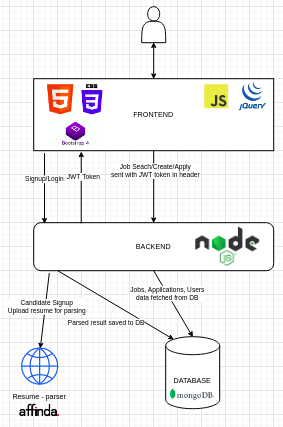

# Job-Search

## Problem Statement

This app should allows Blue Collared workers find job, post the pandemic.

## Technologies Used

HTML,CSS,Bootstrap,JavaScript,JQuery,MongoDB,Node.js

## Features

1. Candidates and Recruiters could register themselves on the signup page
2. Candidate's resume is uploaded on the server and is parsed to extract information like skills,education,past experiences etc and all this information is stored in the database
3. Recruiter can login and register a job, view the jobs posted by him/her and view candidates that applied for a specific job sorted in descending order of the total skills of candidate matching with the skills required for the job (candidates having maximum skills matching with the skills required for the job shown
   at the top)
4. Candidates can login and use different fliters (job title,company name, location, skill required) to find the jobs and apply for them. Candidate can also view details of all the companies registered and details of all the jobs applied by him/her.


## Unique features
A proper parser to parse details from the resume of the candidate so that the candidates do not have to manually enter all their professional details.Also based on the candidates skills, the recruiter can see the best candidate (with maximum skills meeting the requirement) at the top.

## Code architecture

A proper MVC architecture has been used for coding.The Model-View-Controller (MVC) is an architectural pattern that separates an application into three main logical components: the model, the view, and the controller. Each of these components are built to handle specific development aspects of an application.The Model component corresponds to all the data-related logic that the user works with.The View component is used for all the UI logic of the application.Controllers act as an interface between Model and View components to process all the business logic and incoming requests, manipulate data using the Model component and interact with the Views to render the final output.



## Serving frontend

```
npm i -g serve
cd frontend
serve views/
```

The frontend is served at http://localhost:5000

## Serving Backend

Step 1: Setup env variables as mentioned in [.env.example](./backend/.env.example)  
Step 2: Install npm packages

```
cd backend
npm i
```

Step 3: Start backend with `npm run start`

The backend is served at http://localhost:3000 or at port `process.env.NODE_PORT`

## Steps to make resume parser work

Step 1: Go to https://affinda.com/resume-parser/free-api-key/  
Step 2: Fill the form to 'Get your free API key' and you will receive a mail containing the api key  
Step 3: Go to backend folder and inside it create a .env file  
Step 4: In the .env file write AFFINDA_TOKEN={API Key received in mail} and save it (key 93618a25c77a65f3bcfa2bc20bc09e63cfe0bf4b can be used)

## Video for demo of the project
https://drive.google.com/file/d/1v5zY9rwdmZyneRM_qAPfaCxHQE_Fm5kn/view?usp=sharing
